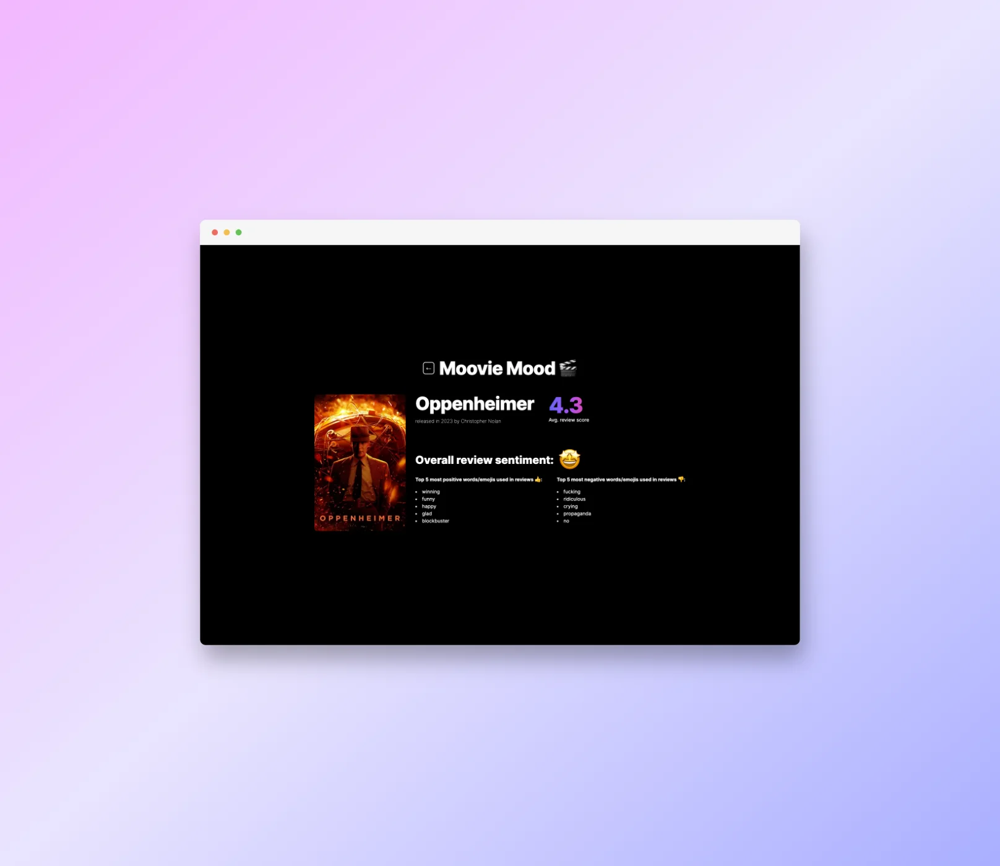

# Movie Mood



Movie Mood is a project that utilizes Puppeteer, a Node.js library, to gather reviews from Letterboxd film entries. This project then conducts sentiment analysis on the top 10 movie reviews, uncovering insights into film metadata and identifying key positive and negative words associated with these reviews.

## Table of Contents

- [Features](#features)
- [Getting Started](#getting-started)
  - [Installation](#installation)
- [License](#license)

## Features

- Automated review collection from Letterboxd film entries.
- Sentiment analysis to determine positive and negative sentiments.
- Extraction of film metadata, providing essential details.
- Identification of key positive and negative words.

## Getting Started

### Installation

1. Clone the repository:

```bash
git clone https://github.com/yourusername/movie-mood.git
```

2. Navigate to the project directory:

```bash
cd movie-mood
```

3. Install the required dependencies:

```bash
npm install
```

4. Run the project

```bash
npm run dev
```

## License

This project is licensed under the [MIT License](LICENSE).
